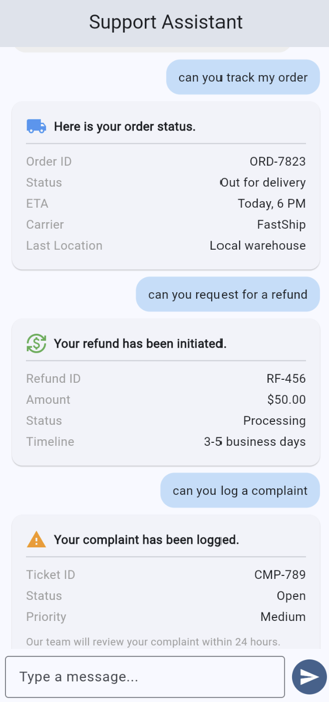
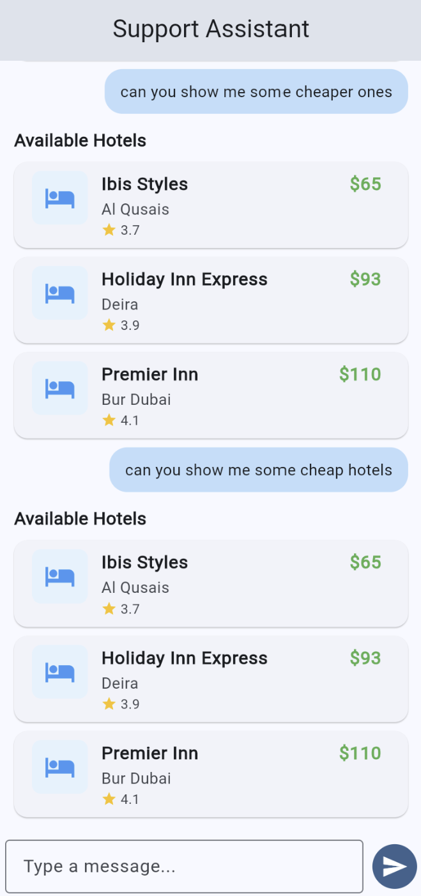
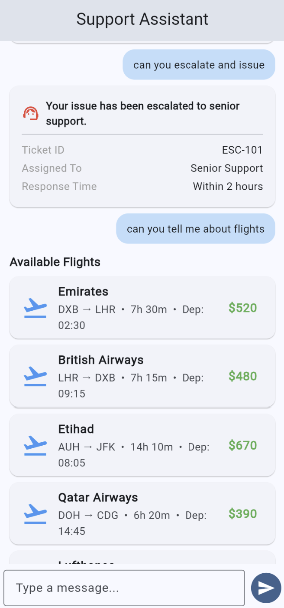

# AI Customer Support Assistant

A local customer support chatbot built with FastAPI, Flutter, and Ollama. The backend classifies what the user is asking using a locally running LLM (llama3.2), calls the right mock tool, and sends back a structured JSON response. Flutter reads the response and renders a matching UI widget — hotel cards, flight listings, order status, etc.

Everything runs offline once the model is pulled.

---

## What it can do

- Look up order status and delivery info
- Process refund requests
- Log complaints and escalate issues to senior support
- Search hotels and flights (with a "show cheaper options" follow-up that actually works)
- Answer questions about its own capabilities

---

## Stack

- **Backend:** Python, FastAPI, httpx
- **LLM:** Ollama running llama3.2 locally
- **Frontend:** Flutter (tested on Chrome)

---

## Setup

You need Python 3.11+, Flutter 3.18+, and Ollama installed.

**Pull the model first — this is the only step that needs internet:**
```bash
ollama pull llama3.2
```

**Backend:**
```bash
cd backend
python -m venv .venv
.venv\Scripts\activate     
pip install -r requirements.txt
uvicorn app.main:app --reload --host 0.0.0.0 --port 8000
```

On Windows you can also just double-click `start_backend.bat`.

Check it's running: `http://localhost:8000/health` should return `{"status":"ok"}`.

**Frontend:**
```bash
cd frontend
flutter pub get
flutter run -d chrome
```

---

## Project structure

```
backend/app/
  main.py          # app setup, CORS, health check
  schemas.py       # request/response Pydantic models
  memory.py        # rolling conversation history (last 5 turns)
  tools.py         # mock tools + hotel/flight data
  routes/chat.py   # the /chat endpoint
  services/ollama.py  # LLM call + intent parsing
```

The frontend is a single `lib/main.dart` — chat screen at the top, one widget class per response type below it.

---

## API

`POST /chat` — send a message, get back a structured response.

```bash
curl -X POST http://localhost:8000/chat \
  -H "Content-Type: application/json" \
  -d '{"message": "show me hotels"}'
```

Response shape:
```json
{
  "intent": "hotel_search",
  "tool_called": "hotel_tool",
  "ui_type": "hotel_page",
  "message": "Available hotels found.",
  "data": {
    "hotels": [
      { "name": "Atlantis The Palm", "price": "$720", "rating": 4.8, "location": "Palm Jumeirah" }
    ]
  }
}
```

The `ui_type` field is what Flutter switches on to pick the right widget. Adding a new intent means adding a tool in `tools.py` and a widget case in `main.dart`.

Other example requests:
```bash
# cheapest flights
curl -X POST http://localhost:8000/chat -H "Content-Type: application/json" -d '{"message": "show me the cheapest flights"}'

# order tracking
curl -X POST http://localhost:8000/chat -H "Content-Type: application/json" -d '{"message": "where is my order"}'

# refund
curl -X POST http://localhost:8000/chat -H "Content-Type: application/json" -d '{"message": "I want a refund"}'
```

---

## How the intent classification works

Each message goes to Ollama with a system prompt that restricts the output to one of 7 intents. Conversation history (last 5 turns) is included so follow-up messages like "show cheaper ones" resolve correctly — the model sees what was discussed before and picks the right intent.

The response comes back as JSON. If the model wraps it in prose anyway, there's a regex fallback that pulls the JSON object out. If classification fails entirely, the endpoint returns a plain text fallback message.

---

## Customising the mock data

All hotel and flight data lives in `backend/app/tools.py` in `_HOTELS` and `_FLIGHTS`. Edit those lists and the server picks up the changes immediately (uvicorn runs with `--reload`).

Order, refund, complaint, and escalation tools return a single hardcoded record each — also in `tools.py`.


## Screenshots

<p align="center">
  
  &nbsp;
  
  &nbsp;
  
</p>